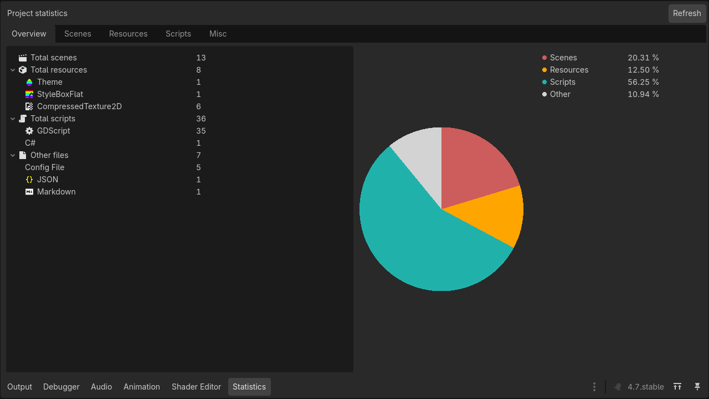
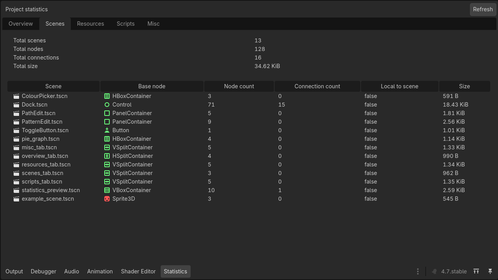
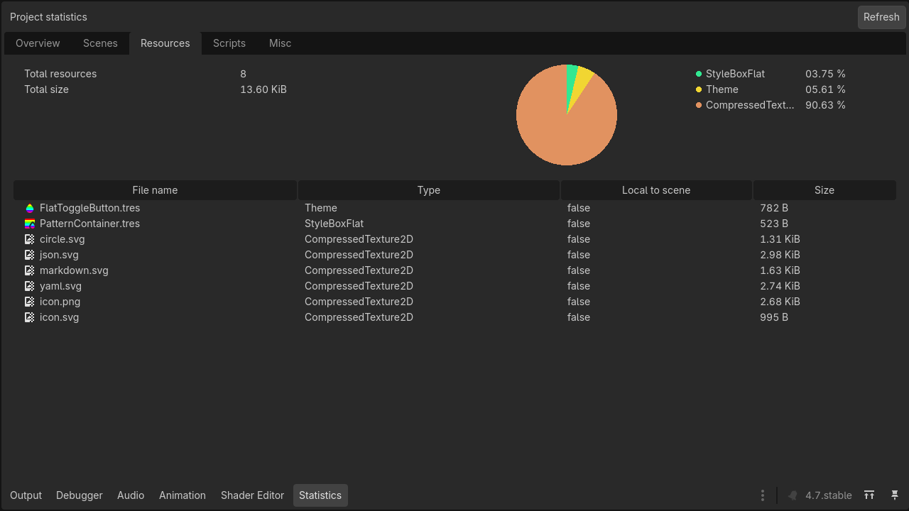
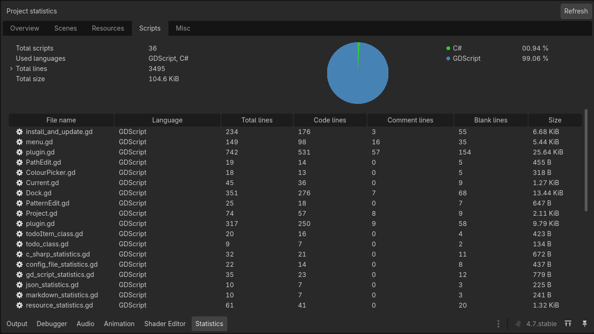
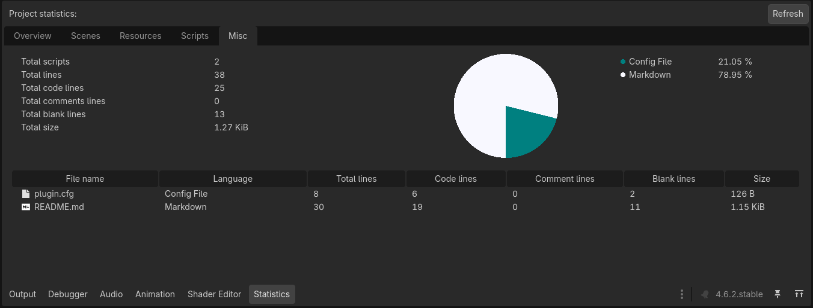

# Godot Project Statistics

An addon for [Godot Engine](https://github.com/godotengine/godot/) that adds a UI panel to display information about the currently open project ([view screenshots](#screenshots)).

## Features

* Number of script lines (code, comments, blank lines and total).
* Number of scenes, size and number of nodes in each scene.
* Number and size of resources.
* Display the size of resources in a pie chart.
* Exclude files or directories from generating statistics.

## Configuration

The configuration can be modified at `Project Settings > Statistics`.

* `Ignore`: List of paths to ignore. (case-sensitive)

* `Include`: List of paths to include regardless of whether the path is found in the `Ignore` list. (case-sensitive)

> Note: matching expressions is possible where "*" matches zero or more arbitrary characters and "?" matches any single character except a period (".")

## Screenshots











## Known limitations

There are some known limitations. For example, GDScript multi-line comments won't be considered as comments.

``` GDScript
"""
This will be considered as normal code
""""
```

If you find out some other ones feel free to open an issue. All suggestions are welcome.

## License

This addon is remake of [Godot Project Statistics](https://github.com/Abdera7mane/godot-project-statistics) for Godot 4 (original addon is only for Godot 3) and it is published under MIT license, see [LICENSE](./LICENSE).
